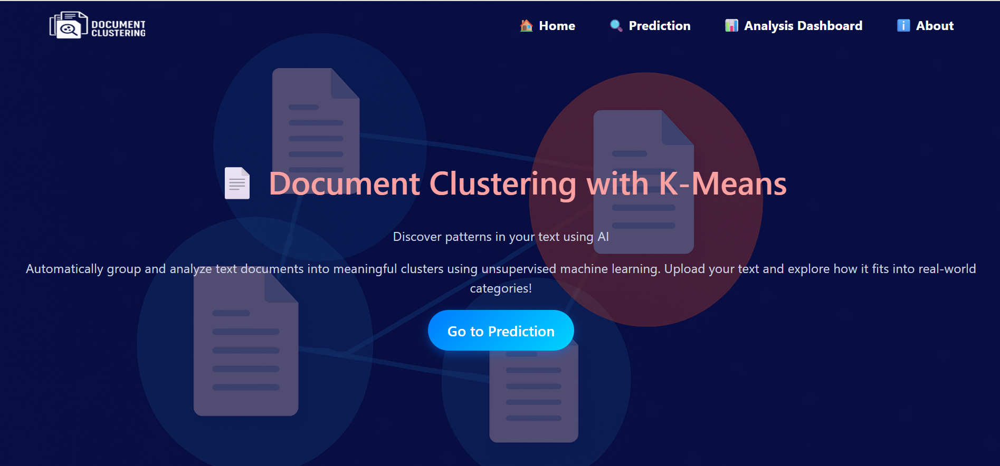

# Document Clustering Using Topic Modelling

## Objective

The objective of this project is to develop an interactive web application that automatically analyzes and categorizes textual documents using unsupervised machine learning techniques, specifically KMeans clustering. By extracting and grouping documents based on similar topics, the system aims to:

- #### Provide a visual and intuitive understanding of underlying themes using topic modeling.

- #### Assist users in identifying the most relevant category for their text.

- #### Display top keywords and generate a wordcloud for easy interpretation.

- #### Show cluster probability distributions to reflect the model’s confidence in topic assignments.

 
## 🚀 Features

- 🧠 **Topic Modeling using KMeans Clustering**
- 📄 Supports input via form or `.txt` file
- ☁️ **WordCloud generation** for each cluster
- 📊 **Bar chart** of probability distribution across all clusters
- 🎨 Responsive and modern UI with animations and interactive sections
- 📁 File upload and preprocessing pipeline
- 📬 Deployment-ready for platforms like Render etc.

## 🛠️ Tech Stack

- `Python`
- `Flask`
- `Scikit-learn`
- `NLTK`
- `Pandas`
- `Numpy`
- `Seaborn`
- `Matplotlib`
- `WordCloud`
- `Machine learning`
- `HTML`, `CSS`, `Bootstrap`

---

# 🧠 Document Clustering Using Topic Modeling (KMeans)

An interactive web application that classifies uploaded or pasted text into topic-based clusters using **KMeans clustering**, with support for visualizations like **word clouds** and **probability distributions**.

---

## 📸 Screenshots

### 🏠 Home Page


### 📊 Prediction Result with Wordcloud


### 🔢 Cluster Probability Chart


> 📝 Make sure these images are placed in your `/static/screenshots/` folder or use relative GitHub raw URLs if hosted there.

---

## 🌐 Live Demo

👉 [Visit the deployed app](https://document-clustering-using-topic-modelling.onrender.com/)

---

## 📦 GitHub Repository

🔗 [](https://github.com/satendra27/Document-Clustering-Using-Topic-Modelling.git)

---

## 🚀 Getting Started

### 🔧 Installation

```bash
git clone https://github.com/your-username/document-clustering.git
cd document-clustering
pip install -r requirements.txt
python app.py


